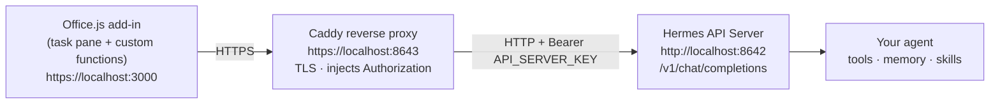
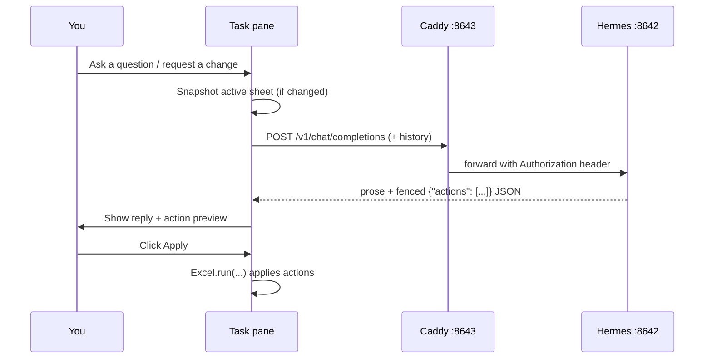

<!-- markdownlint-disable MD033 -->
<p align="center">
  
  &nbsp;&nbsp;<b>➕</b>&nbsp;&nbsp;
  
</p>

<h1 align="center">Altera</h1>

<p align="center">
  <strong>Hermes Agent Office</strong><br />
  Put your own <a href="https://github.com/NousResearch/hermes-agent">Hermes</a> agent
  <strong>inside Microsoft Office</strong> — your models, your skills, your approval gate.<br />
  <em>Not Copilot.</em>
</p>

<p align="center">
  <a href="https://github.com/NousResearch/hermes-agent"></a>
  
  
  
  
  
  
  
  
  <a href="./LICENSE"></a>
</p>

---

## ✨ What is Altera?

**Altera** turns Microsoft Office into a first-class client for **your own AI agent**. Instead of renting a black-box assistant, you connect a [Hermes](https://github.com/NousResearch/hermes-agent) agent you control — with your models, your tools, your memory, and your skills — and drive it from right where the work lives: inside the spreadsheet.

- 🧠 **Your agent, your rules.** Hermes brings the *full* agent (tools, memory, skills), not a stripped-down model proxy.
- 🔐 **Approval gate by default.** Nothing in your workbook changes until you review the proposed actions and click **Apply**.
- 🔌 **One backend, many apps.** A single shared Hermes API Server + Caddy proxy powers every Altera add-in.
- 🧮 **Chat *and* cells.** Talk to the agent in a task pane, or call it straight from a formula with `=HERMES.*`.

## 🧩 Features

### 💬 Task-pane chat (Excel)

Open the pane, talk about the **active sheet**, and the agent replies in plain language. When you ask for a change, it appends a single fenced JSON block describing the actions it wants to take. Altera parses that block, renders a human-readable **preview**, and waits for your approval.

- Reads the active sheet (values only) and sends it once per change — up to **500 rows** (`MAX_ROWS`).
- Re-sends the snapshot only when the sheet's signature (name + range + content hash) changes, keeping the conversation cheap.
- **Nothing is written until you click Apply.**

**Supported actions**

| Action | Effect |
|--------|--------|
| `setCell` | Set one cell, highlighted green for easy review |
| `setCells` | Fill a range from a 2-D array |
| `format` | Number format, bold, fill colour |
| `createTable` | Turn a range into an Excel table |
| `createChart` | Insert a chart (Column, Bar, Line, Pie, Scatter, …) |
| `newSheet` | Add a worksheet |
| `renameSheet` | Rename the active tab |

### 🧮 Custom functions (`=HERMES.*`)

Call the agent from a cell. These are **read-only**, cached, and drag-fillable.

| Function | What it does | Example |
|----------|--------------|---------|
| `=HERMES.CLASSIFY` | Label a value per your instruction | `=HERMES.CLASSIFY(A2, "lead quality: hot/warm/cold")` |
| `=HERMES.EXTRACT` | Pull a field out of text | `=HERMES.EXTRACT(A2, "company name")` |
| `=HERMES.SUMMARIZE` | One-sentence summary of a range | `=HERMES.SUMMARIZE(A1:D20)` |
| `=HERMES.FORMULA_HELP` | Get an Excel formula from a goal | `=HERMES.FORMULA_HELP("year-over-year growth")` |

> Text arguments must be quoted; the first argument may be a cell reference. The namespace uses a **dot** — `=HERMES.CLASSIFY`, not `=HERMES_CLASSIFY`.
## 🏗️ Architecture

Every Altera add-in talks to the same shared backend. Hermes exposes its **full agent** — tools, memory, skills — as an OpenAI-compatible HTTP endpoint (the **API Server**, *not* `hermes proxy`, which is model-only). Each add-in calls `/v1/chat/completions`; a one-line **Caddy** proxy adds the HTTPS that Office requires and injects the bearer token, so no add-in ever holds the key.



<details>
<summary>Plain-text version of the diagram</summary>

```
Office add-in ──HTTPS──▶ Caddy (:8643, TLS + injects key) ──▶ Hermes API Server (:8642) ──▶ your agent
```
</details>

### Request flow (chat → propose → approve)



## 📦 Apps

Each app is a self-contained Office.js add-in. They all share the same backend described below.

| App | Status | Surface | Folder |
|-----|--------|---------|--------|
| **Excel** | ✅ Available | Task-pane chat + `=HERMES.*` custom functions | [`excel/`](./excel) |
| **Word** | 🗓️ Planned | — | — |
| **PowerPoint** | 🗓️ Planned | — | — |

## 🚀 Quick start

Three steps: **enable the backend once**, **run the proxy**, then **run an app**.

```text
1. Enable the Hermes API Server   →  ~/.hermes/.env  +  hermes gateway
2. Run Caddy (HTTPS + auth)       →  caddy run
3. Run an add-in                  →  cd excel && npm install && npm start
```

## Shared backend (set up once, used by every app)

Hermes already exposes the **full agent** (tools, memory, skills) as an OpenAI-compatible HTTP endpoint — the **API Server** (not `hermes proxy`, which is model-only). Each add-in calls `/v1/chat/completions`; a one-line Caddy proxy adds HTTPS and injects the bearer token.

**1. Enable the Hermes API Server** — add to `~/.hermes/.env`:

```env
API_SERVER_ENABLED=true
API_SERVER_KEY=<a long random secret you choose>
API_SERVER_CORS_ORIGINS=https://localhost:3000
```

Start (or restart) the gateway — the API server runs inside it:

```bash
hermes gateway
```

Confirm: `curl http://localhost:8642/v1/health` → `{"status":"ok",...}`

**2. Run Caddy** (HTTPS + auth injection):

```bash
cp Caddyfile.example Caddyfile     # then edit it: paste your API_SERVER_KEY
caddy run
```

Confirm: `curl https://localhost:8643/v1/health`

**3. Run an app** — `cd` into the app folder (e.g. `excel/`) and follow its README:

```bash
cd excel
npm install
npm start
```

### Environment variables

| Variable | Purpose |
|----------|---------|
| `API_SERVER_ENABLED` | Turns on the OpenAI-compatible agent endpoint. |
| `API_SERVER_KEY` | Bearer secret. Caddy injects it; add-ins never see it. |
| `API_SERVER_CORS_ORIGINS` | Origin allow-list — keep it narrow (e.g. `https://localhost:3000`). |
## 🛠️ Tech stack

| Layer | Technology | Role | Link |
|-------|-----------|------|------|
| Agent | **Hermes** | Provides the agent (tools, memory, skills) over an OpenAI-compatible API | [github.com/NousResearch/hermes-agent](https://github.com/NousResearch/hermes-agent) |
| Host app | **Microsoft Excel** | Where the add-in lives (desktop, Windows/Mac) | [Excel](https://www.microsoft.com/microsoft-365/excel) |
| Add-in API | **Office.js / Office Add-ins** | Task pane, custom functions, workbook access | [learn.microsoft.com/office/dev/add-ins](https://learn.microsoft.com/office/dev/add-ins/) |
| Runtime | **Node.js 18+** | Dev server, build tooling | [nodejs.org](https://nodejs.org/) |
| Language | **JavaScript** (+ Babel) | Add-in source, transpiled for the Office webview | [developer.mozilla.org/JavaScript](https://developer.mozilla.org/docs/Web/JavaScript) |
| Bundler | **Webpack 5** | Bundles task pane, commands, and functions | [webpack.js.org](https://webpack.js.org/) |
| Custom functions | **custom-functions-metadata-plugin** | Generates `functions.json` from JSDoc | [npm](https://www.npmjs.com/package/custom-functions-metadata-plugin) |
| Tooling | **office-addin-debugging / dev-certs** | Sideload + trusted HTTPS on `:3000` | [npm](https://www.npmjs.com/package/office-addin-debugging) |
| Proxy | **Caddy** | TLS termination on `:8643` + bearer-token injection | [caddyserver.com](https://caddyserver.com/) |
| Lint | **ESLint (office-addin-lint)** | Code style & correctness | [eslint.org](https://eslint.org/) |

## 🗂️ Repository layout

```text
Altera/
├── README.md                 # you are here
├── Caddyfile.example         # copy → Caddyfile, paste your API_SERVER_KEY
├── LICENSE                   # MIT
├── public/                   # README artwork
│   ├── Hermes.png
│   └── MicrosoftExcel.png
└── excel/                    # the Excel add-in (self-contained)
    ├── manifest.xml          # Office add-in manifest (namespace: HERMES)
    ├── webpack.config.js
    ├── package.json
    └── src/
        ├── shared/hermes.js      # one place both surfaces call Hermes
        ├── taskpane/             # chat UI (html/css/js)
        ├── functions/            # =HERMES.* custom functions
        └── commands/commands.js
```

## 🔒 Security

> ⚠️ The API Server gives the agent its **full toolset, including terminal commands**. Treat `API_SERVER_KEY` like a password.

- Make the key **long and random**, and **never commit** your real `Caddyfile` or `.env` (both are git-ignored).
- **Bind everything to `localhost`** and keep `API_SERVER_CORS_ORIGINS` as narrow as possible.
- **No add-in ever holds the key** — Caddy injects the `Authorization` header server-side.
- Only `Authorization`, `Content-Type`, and `Idempotency-Key` are allowed by the API server's CORS policy. Don't send other custom headers from the client, or the browser preflight fails ("Failed to fetch").

## ❓ FAQ & gotchas

<details>
<summary><strong>I get "Failed to fetch" from the add-in.</strong></summary>

Check the CORS allowed headers are exactly `Authorization, Content-Type, Idempotency-Key`. Any extra custom header triggers a failed preflight.
</details>

<details>
<summary><strong>My code edits aren't showing up in the pane.</strong></summary>

The add-in uses a **shared runtime**, so it may keep running the old bundle. Right-click the pane → **Reload**; if it persists, quit Excel and run `npm start` again.
</details>

<details>
<summary><strong>Why is my custom function not found?</strong></summary>

Custom functions use a **dotted namespace**: `=HERMES.CLASSIFY`, not `=HERMES_CLASSIFY`.
</details>

<details>
<summary><strong>How does conversation memory work?</strong></summary>

The pane sends the **full message history** each call, so there are no server-side sessions to manage. The active-sheet snapshot is only re-sent when the sheet actually changes.
</details>

## 🤝 Credits

**Inspired by Tonbi, made by [4SRG](https://github.com/zannunakiz).**

## 📄 License

Released under the **MIT License** — see [LICENSE](./LICENSE).
